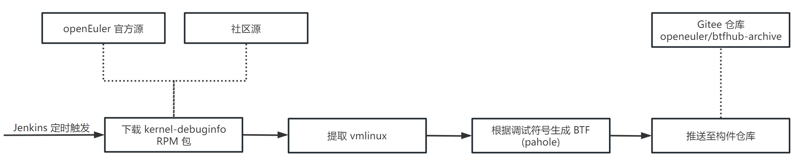

# openEuler BTF 管理基础设施介绍

## 项目背景与需求

### 项目背景

eBPF 的应用（尤其是可观测性方面的应用）通常依赖于内核中的特定函数或数据结构。而内核中的函数与数据结构经常随版本、编译配置变化而改变；对于不同平台上运行的内核，一些内部函数与数据结构也通常不同。这为 eBPF 程序带来了对不同版本、不同配置、不同平台内核的兼容性与可移植性问题。

内核社区目前提供了 [CO-RE（Compile Once, Run Everywhere）](https://nakryiko.com/posts/bpf-portability-and-co-re/)特性以解决这一问题。CO-RE 通过比对 eBPF 程序与目标平台所携带的类型元信息，结合 eBPF 程序构建时嵌入的重定位信息，在加载 eBPF 程序前针对修改程序字节码，以兼容目标平台。除了兼容性方面的应用，CO-RE 也可用于对目标平台内核特性的探测。

CO-RE 依赖于 eBPF 程序以及目标平台内核中附带的类型元信息；这些信息通常以 [BTF（BPF Type Format）](https://www.kernel.org/doc/html/next/bpf/btf.html)格式嵌入在 eBPF 程序与内核 ELF 中。而一些旧版本内核不支持 BTF，或编译时未启用 `DEBUG_INFO_BTF` 选项提供内核 BTF 信息，使得 eBPF 程序运行在这些平台时无法使用 CO-RE 提供兼容性支持，从而导致兼容性问题。

[BTFHub](https://github.com/aquasecurity/btfhub) 为多种发行版（包括 Debian、Ubuntu、Fedora、CentOS 等）多个版本内核提供了预构建的 BTF，eBPF 程序开发者可将 BTF 与 eBPF 程序一同分发，解决在不支持 BTF 的内核上运行 eBPF 程序的兼容性问题。但目前 BTFHub 项目未提供对 openEuler 发行版的支持。

### 项目需求

openEuler BTF 管理基础设施对标原 BTFHub，需要为 openEuler 发行版用户提供 openEuler 各版本、各平台内核的预构建 BTF。

作为 2023 开源之夏项目 [eBPF 软件版本兼容性技术工作](https://summer-ospp.ac.cn/org/prodetail/23b970500)的一部分，openEuler BTF 管理基础设施基本建成后，需要配合 [bpf-compatible](https://github.com/eunomia-bpf/bpf-compatible) 项目，以 openEuler 社区可观测性框架 [gala-gopher](https://gitee.com/openeuler/gala-gopher) 为试点，推进其中 eBPF 程序兼容性处理工作。

## 总体方案

openEuler BTF 管理基础设施中构建 BTF 的工具（`btfhub` 工具）目前基于原 BTFHub 中 BTF 生成工具改造，适配 openEuler 发行版与 openEuler 社区的基础设施。

为使预构建的内核 BTF 保持更新，BTF 构建过程在 openEuler 社区 Jenkins 实例中作为 CI 流水线自动运行（可见 [openEuler-BTFHub/update-archive](https://jenkins.osinfra.cn/job/openEuler-BTFHub/job/update-archive/)），定时触发并更新 BTF。

基于原 BTFHub 中 BTF 生成工具设计，openEuler 系统内核 BTF 基于 `kernel-debuginfo` 软件包中提供的 DWARF 调试符号生成。BTF 构建流程步骤包括：

1. 下载 `kernel-debuginfo` RPM 包：为 openEuler 系统构建 BTF 时，目前支持从 [openEuler 官方源](https://repo.openeuler.org/)下载 `x86_64` 与 `aarch64` 平台各版本 `kernel-debuginfo` 包，后续可能支持接入其他社区源，为其他平台生成 BTF 提供支持；
2. 提取 `vmlinux`；
3. 根据调试符号生成 BTF：利用 `pahole --btf_encode_detached` 基于内核 DWARF 调试符号生成裸 BTF，并归档、压缩；
4. 推送至构件仓库：为 openEuler 系统预构建的 BTF 被推送至 [openEuler BTF 资源归档仓（`openeuler/btfhub-archive`）](https://gitee.com/openeuler/btfhub-archive)；由于仓库规则限制，从 CI 流水线无法直接推送至 `master` 分支，因此推送至 `next` 分支并提出 PR 供人工审核。
