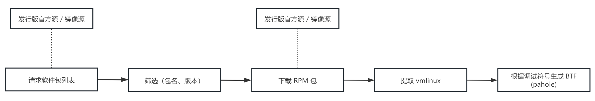
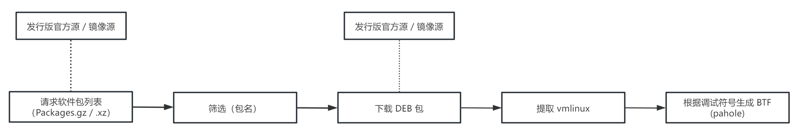
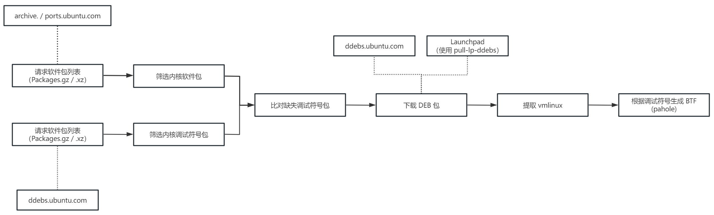

# BTF 生成工具重构方案

## 背景

### 当前问题

原 BTF 生成工具（`btfhub` 工具）是由一组 Shell 脚本演化而来，当前设计中还存在一些问题：

1. **配置与代码不分离。**`btfhub` 工具中部分逻辑，包括每个发行版支持的版本、每个版本对应的 YUM / APT 仓库 URL 等，比其他下载、解压、转换等逻辑变动更频繁，最好抽取为配置项。而目前 `btfhub` 将这些配置信息均硬编码在代码中（如[发行版支持版本信息](https://gitee.com/openeuler/btfhub/blob/abf4400/cmd/btfhub/main.go#L19-L28)、[openEuler 各版本仓库 URL](https://gitee.com/openeuler/btfhub/blob/abf4400/pkg/repo/openeuler.go#L24-L47)），各发行版配置需要变动时只能修改代码，不够灵活；

2. **部分逻辑重复。**`btfhub` 工具从各发行版官方软件源下载内核调试符号包以生成 BTF。目前支持的发行版中，CentOS、Fedora、Oracle Linux、openEuler 等采用 yum 包管理器的发行版逻辑基本一致（有细微差别），存在一些重复代码，需要优化。

### 重构目标

针对上述问题，对 `btfhub` 工具的重构主要计划目标包括：

1. 将较频繁变动的部分逻辑抽取作为配置项，使 `btfhub` 工具运行时读取配置文件，发行版版本信息、仓库 URL 等变动时仅需修改配置文件；
2. 基于目前针对每个发行版的 BTF 生成逻辑进一步抽象，减少重复代码，降低扩展支持其他发行版的难度。

## 方案

### 配置方案

初步计划采用 YAML 作为配置语言。配置中，`btfhub` 工具支持的每个 `(发行版, 版本, 平台)` 元组都有对应的 BTF 生成配置；具体配置为字典格式，其中 `$type` 字段表示具体生成类型（如通用 YUM、通用 APT 等），其余字段为特定于该类型 BTF 生成的配置项。配置文件按照 `btf > 发行版名称 > 版本 > 平台 > 具体配置项` 的树形结构组织。

配置文件示例：


```yml
# BTF 生成相关配置
btf:
  # 发行版名称
  openEuler:
    # 发行版版本 (release)
    22.03:
      # 平台
      x86_64:
        # BTF 生成逻辑类型（通用 YUM）
        $type: generic-yum
        # 通用 YUM 方式生成 BTF 配置项：仓库 URL
        repos:
        - https://repo.openeuler.org/openEuler-22.03-LTS/debuginfo/x86_64/Packages/
        - https://repo.openeuler.org/openEuler-22.03-LTS-SP1/debuginfo/x86_64/Packages/
        - https://repo.openeuler.org/openEuler-22.03-LTS-SP2/debuginfo/x86_64/Packages/
        filters:
            # 通用 YUM 方式生成 BTF 配置项：匹配 kernel-debuginfo 包正则
            regex: 'kernel-debuginfo-([-1-9].*\.x86_64)\.rpm'
```

### 初步实现方案

将 `btfhub` 工具生成 BTF 的逻辑抽象为一个统一接口 `CanGenerateBTF`，后续实现该接口的类型即可整合进 `btfhub` 工具生成 BTF 的流程。

```go
type CanGenerateBTF interface {
    // 异步生成 BTF 并保存到 workDir
    GenerateBTF(
        workDir string,
        ctx context.Context,
        jobChan chan<- job.Job,
    ) error
}
```

程序启动时，从配置文件读取各个发行版版本、平台相关的 BTF 生成配置，为每一种配置创建 `CanGenerateBTF` 实例；具体生成的类型由配置中 `$type` 对应注册的 `CanGenerateBTFCreator` 实例决定。

```go
// 根据发行版、版本、平台以及具体配置项创建 CanGenerateBTF 实例
type CanGenerateBTFCreator = func (
    distro string,
    release string,
    arch string,
    options interface{},
) (CanGenerateBTF, error)

// 各实现将对应 creator 注册到 map
var CanGenerateBTFCreators = map[string]CanGenerateBTFCreator {
    "generic-yum": createYUMGenerateBTF,
    "generic-apt": createAPTGenerateBTF,
    // ...
}
```

由于目前实现中多个发行版的 BTF 生成逻辑类似，仅有细微不同，存在重复代码，因此计划基于 `CanGenerateBTF` 接口实现几种通用 BTF 生成逻辑（如通用 YUM、通用 APT），将现有实现中每个发行版的生成 BTF 逻辑尽量迁移到到通用逻辑上，以减少代码冗余。

#### 基于 YUM 仓库生成 BTF 通用实现

**适用发行版：** CentOS、Fedora、openEuler、Oracle Linux

以上几个发行版相关生成 BTF 的特点是从 YUM 仓库下载 `kernel-debuginfo` 包，获取内核调试符号，以执行后续操作，因此被归为一类，迁移到基于 YUM 生成 BTF 的通用实现。

该实现生成 BTF 的流程大致如下：



流程中可以修改的配置项如下：

| 配置项 | 类型 | 必填 | 含义 |
| ----- | ---- | --- | ---- |
| `repos` | `[]string` | Y | YUM debuginfo 仓库 URL；可以指定多个 URL，以适配多个 debuginfo 仓库场景（如 openEuler 22.03） |
| `filters.regex` | `string` | - | 正则表达式；用于筛选出 `kernel-debuginfo` 包并提取内核版本
| `filters.minVersion` | `string` | - | 支持的最小内核版本；适配 CentOS、Oracle Linux 同一发行版 release 下内核版本过多的场景 |

#### 基于 `yum` 工具生成 BTF 通用实现

**适用发行版：** Amazon Linux、RHEL

Amazon Linux 与 RHEL 所使用的 YUM 仓库似乎无法直接访问、下载 YUM 包，因此需要借助本地 `yum` 工具搜索和下载 `kernel-debuginfo` 包，以执行后续操作。

该实现生成 BTF 的流程大致如下：


流程中可以修改的配置项如下：

| 配置项 | 类型 | 必填 | 含义 |
| ----- | ---- | --- | ---- |
| `commands.prepare` | `string` | - | 搜索前执行的命令；适配 RHEL 搜索前需要执行 `subscription-manager release --set=...` 的场景 |
| `commands.search` | `string` | - | 利用 `yum` 搜索 `kernel-debuginfo` 使用的命令 |
| `commands.download` | `string` | - | 下载指定 `kernel-debuginfo` 包使用的命令 |

#### 基于 APT 仓库生成 BTF 通用实现

**适用发行版：** Debian

目前为 Debian 生成 BTF 的逻辑是从官方 APT 仓库下载内核调试符号包，，以执行后续操作。对其进一步抽象可以将其适用范围扩展到其他使用 APT 的发行版。

基于 APT 仓库生成 BTF 的流程大致如下：



流程中可以修改的配置项如下：

| 配置项 | 类型 | 必填 | 含义 |
| ----- | ---- | --- | ---- |
| `repos` | `[]string` | Y | 包含调试符号包的 APT 仓库 URL；可以指定多个 URL |
| `filters.regex` | `string` | - | 正则表达式；用于筛选出内核调试符号包，并提取内核版本 |

#### 为 Ubuntu 生成 BTF 实现

相比于基于 APT 生成 BTF 的通用实现，为 Ubuntu 生成 BTF 的过程略微复杂，含有一些 Ubuntu 特定的逻辑，因此单独处理：

1. Ubuntu 官方内核有多个 flavor，除通用的 `generic` 外，主要用于支持各种特定场景（如 `aws`、`gke` 等支持不同云平台，`kvm` 支持 KVM 等）；不同的 flavor 之间是平行的，需要分别处理；
2. Ubuntu 官方仓库中能够匹配到的一部分内核包是 meta package，无法从 APT 仓库直接下载调试符号，需要使用本地安装的 `pull-lp-ddebs` 工具下载内核调试符号包。

为 Ubuntu 生成 BTF 的流程大致如下：



流程中可以修改的配置项如下：

| 配置项 | 类型 | 必填 | 含义 |
| ----- | ---- | --- | --- |
| `repos.kernel` | `[]string` | Y | 包含内核包的 APT 仓库 URL；可以指定多个 URL |
| `repos.debug` | `string` | - | 包含调试符号包的 APT 仓库 URL |
| `filters.regex` | `string` | - | 正则表达式；用于筛选出内核调试符号包 |
| `filters.minSize` | `int` | - | 内核调试符号包最小大小；用于过滤签名后的内核对应的空调试符号包 |
